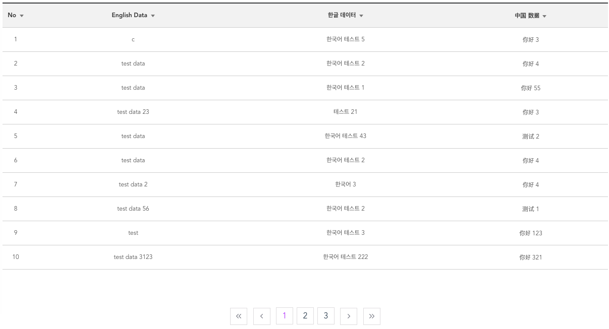

# vue-pagination

> Supports Vue 2.x <br>
> Test Version is 0.1.x && 0.2.x

## Introduction

You can create a bulletin board with just array data.<br>
Use it comfortably !<br>

I want Git Star...

## installation

``` bash
npm install --save @dinnerkang/vue-pagination
```
## Usage
```bash
props: {
    data: {
      type: Array,
      required: true
    },
    isIndex: {
      type: Boolean
    }
  },
```

``` bash
<template>
    <div>
        <Pagination :data="array" :isIndex="true"></Pagination>
    </div>
</template>

<script>
import Pagination from '@dinnerkang/vue-pagination'
export default{
    data(){
        return{
            array : [{
                "English Data" : "c",
                "한글 데이터" : "한국어 테스트 5",
                "中国 数据" : "你好 3"
            },{
                "English Data" : "test data",
                "한글 데이터" : "한국어 테스트 2",
                "中国 数据" : "你好 4"
            }, ...........
            ]
        }
    }
}
</script>
```



You must have a **' :data="Your Array" '** <br>

Sorting is available <br>

If you do not want to 'Index' you must have a **' :isIndex="true" '**<br>

## Questions or Issue

Please send mail to jenhyuk0318@gmail.com or Leave the issue to Git

